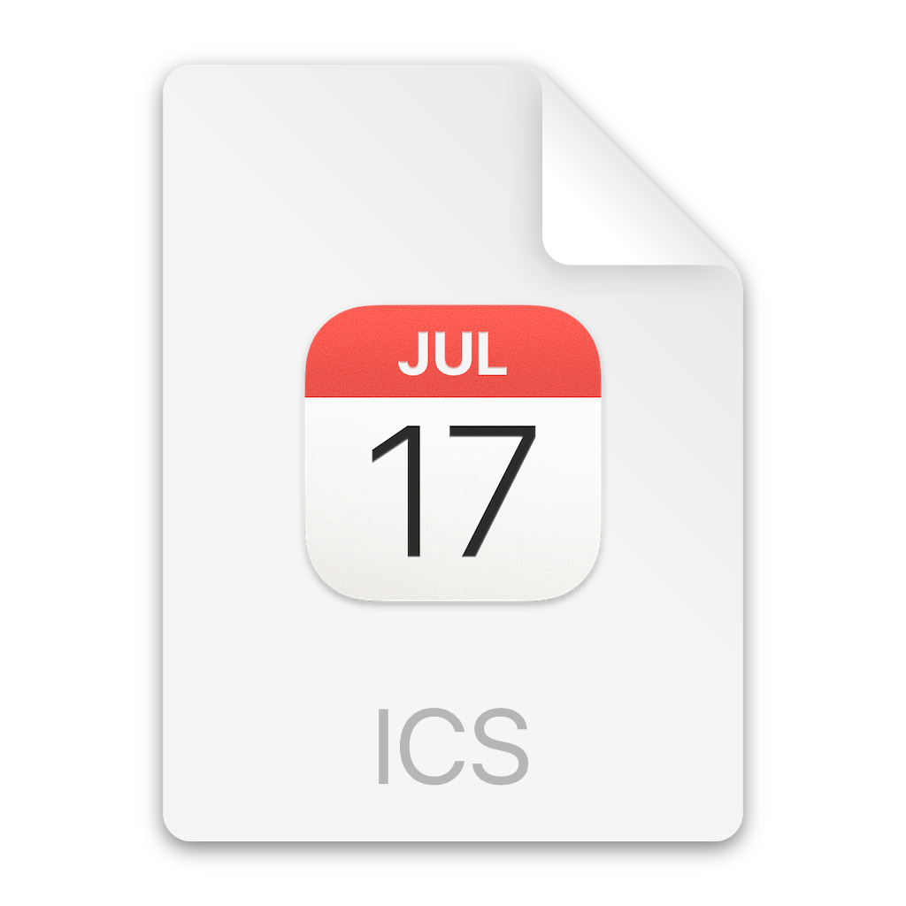

<h1>
  
  &nbsp;icsio
</h1>

`icsio` is an API for modifing calendar subscriptions.

## Get started

### Initial request

To perform a basic ICS modification, provide the API with a target calendar URL, encoded using `encodeURIComponent`:

```js
encodeURIComponent("https://example.com") // https%3A%2F%2Fexample.com
```

Pass this as the `url` query parameter. You can then supply one or more pairs of `rin` and `rout` query parameters to define a regular expression to match and the text to replace it with. Both values must also be encoded.

```http
GET http://localhost:3000?url=https%3A%2F%2Fexample.com&rin=%28%3Fm%29%5ESUMMARY%3A%5CS%2B%20&rout=SUMMARY%3A
```
